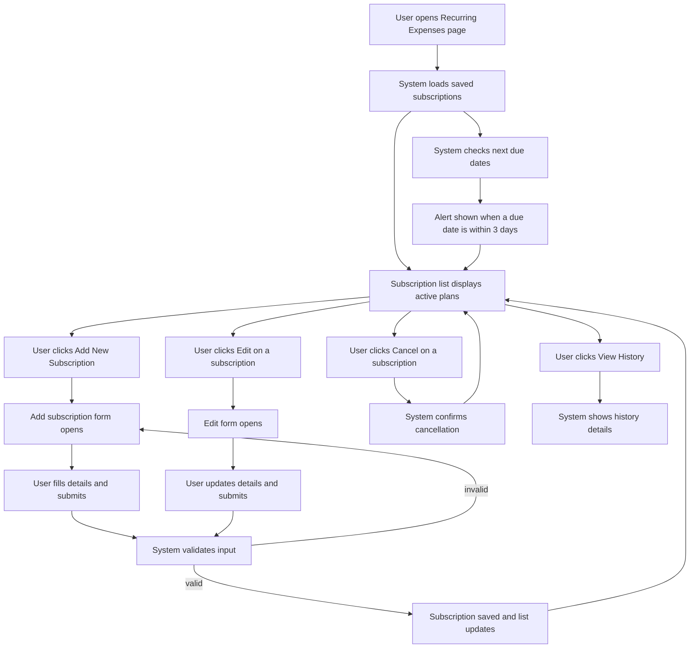

# 13. UI/UX Wireframes

## Overview
Wireframes are visual representations of the user interface layout, showing the structure, hierarchy, and flow of screens in the SpendSmart application. This document provides detailed wireframes for all major user-facing pages and features.

---

## 1. Authentication Pages

### 1.1 Sign Up Page
**Layout:**
- Logo/Branding at top
- "Create Account" heading
- Email input field with validation
- Password input field with strength indicator
- Confirm password field
- Terms & conditions checkbox
- Sign Up button (primary)
- "Already have an account? Login" link

**Key Features:**
- Real-time email validation
- Password strength indicator (Weak/Fair/Strong)
- Show/hide password toggle
- Loading state on button during submission
- Success message after account creation

### 1.2 Login Page
**Layout:**
- Logo/Branding
- "Welcome Back" heading
- Email input field
- Password input field
- "Forgot Password?" link
- Login button (primary)
- "Don't have account? Sign Up" link

**Key Features:**
- Remember me checkbox (optional)
- Loading state during authentication
- Error handling for invalid credentials
- Rate limiting message (after 5 failed attempts)

### 1.3 OTP Verification Page
**Layout:**
- "Verify Your Email" heading
- Email address display (partially masked)
- 6-digit OTP input (auto-focus and tab-navigation)
- "Resend OTP" link (disabled until 30 seconds pass)
- Countdown timer (5:30 remaining)
- Verify button
- "Change Email" link

**Key Features:**
- Auto-focus on first input
- Tab navigation between digits
- Countdown timer for OTP expiration
- Resend option with cooldown
- Error message for invalid OTP

---

## 2. Dashboard & Main Layout

### 2.1 Main Dashboard Layout Structure
```
┌─────────────────────────────────────────────────────────┐
│ HEADER: Logo | Dashboard | Analytics | Goals | Profile  │
├──────────────┬──────────────────────────────────────────┤
│   SIDEBAR    │                                           │
│  - Dashboard │          MAIN CONTENT AREA               │
│  - Add       │  All-Time Analytics                      │
│  - Scan      │  ┌─────┬──────┬──────┬─────────┐        │
│  - Voice     │  │Total │ Days │ Avg/ │  Trans  │        │
│  - History   │  │Spent │Track │ Day  │  Count  │        │
│  - Analytics │  └─────┴──────┴──────┴─────────┘        │
│  - Goals     │                                           │
│  - Subs      │  Monthly Budget | Smart Advice | Recents  │
│  - Notif     │                                           │
│  - Profile   │                                           │
│  - Settings  │                                           │
└──────────────┴──────────────────────────────────────────┘
```

### 2.2 Dashboard Components

#### All-Time Analytics Widget
**Content:**
- Total Spent (PKR value)
- Days Tracked (count)
- Average Per Day (PKR value)
- Total Transactions (count)

**Visuals:**
- Large numbers in primary color
- Icons for each metric
- Sparkline trends (optional)

#### Monthly Budget Progress Widget
**Content:**
- Progress bar (visual percentage)
- Amount used vs. limit
- Remaining balance
- Status indicator (On Track / Over Budget)
- Percentage used

**Visuals:**
- Green for on-track, red for over-budget
- Animated progress bar fill
- Hover tooltip with exact amounts

#### Smart Advice Widget
**Content:**
- Spending Score (0-100)
- Key insight message
- Behavioral recommendation
- Action button

**Visuals:**
- Score displayed prominently
- Icon representing advice type
- Slightly highlighted background

#### Recent Transactions List
**Content:**
- Last 5-10 transactions
- Category, amount, date for each
- Quick action buttons (edit, delete)

**Visuals:**
- Category icon and color
- Alternating row colors
- "View All" link at bottom

#### Streaks & Badges Widget
**Content:**
- Current streak counter
- Best streak milestone
- Recently earned badges
- Progress toward next badge

**Visuals:**
- Fire emoji for active streaks
- Badge icons
- Progress bar for upcoming badge

---

## 3. Expense Management Pages

### 3.1 Add Expense (Manual) Page
**Layout:**
```
Form Title: "Add New Expense"

Amount Input:
├─ Label: "Amount"
├─ Input: Number field (required)
├─ Placeholder: "Enter amount..."
└─ Validation: "Amount must be greater than 0"

Category Dropdown:
├─ Label: "Category"
├─ Dropdown with categories (Food, Transport, etc.)
└─ Search functionality in dropdown

Date & Time:
├─ Date Picker (Default: Today)
├─ Time Picker (Default: Current time)
└─ Both optional

Description:
├─ Label: "Description (Optional)"
├─ Text Area (3 lines)
└─ Placeholder: "Where did you spend this?"

Receipt Image:
├─ Upload Button
├─ Preview if image selected
└─ Optional

Buttons:
├─ Save (Primary)
├─ Cancel (Secondary)
└─ Save & Add Another (Optional)
```

**Features:**
- Real-time validation
- Category suggestions based on description
- Quick category selection with color coding
- Receipt image preview
- Keyboard shortcut to quick-save

### 3.2 Scan Receipt (OCR) Page
**Layout:**
```
"Scan Receipt" Title

Camera/Upload Area:
├─ Large area for preview
├─ Take Photo Button
└─ Upload from Gallery Button

OCR Results (Auto-filled):
├─ Detected Amount
├─ Detected Store/Merchant
├─ Extracted Date
└─ Confidence Score

Confirmation Form:
├─ Amount (editable if confidence low)
├─ Category (dropdown, required)
├─ Description (optional)
└─ Save Button
```

**Features:**
- Camera access request
- Image upload with drag-drop
- Real-time OCR processing
- Loading indicator during processing
- Manual correction fields
- Confidence score indicator
- Ability to retake photo
- Batch scanning (future)

### 3.3 Voice Input Page
**Layout:**
```
"Log Expense by Voice"

Microphone Area:
├─ Large microphone icon
├─ "Press to record" instruction
├─ Recording timer (MM:SS)
└─ Visual audio waveform

Transcribed Text:
├─ User's spoken input (editable)
├─ Detected amount highlighted
└─ Detected category highlighted

Extracted Information:
├─ Amount: PKR [amount] (editable)
├─ Category: [category] (editable)
└─ Description: [extracted text]

Action Buttons:
├─ Save (Primary)
├─ Discard & Record Again (Secondary)
└─ Edit & Confirm (Tertiary)
```

**Features:**
- Voice activation (tap to record)
- Live transcription
- Waveform visualization during recording
- Playback option
- Manual editing of transcribed text
- Natural language processing for amount/category
- Keyboard shortcut for voice input

---

## 4. Analytics & History Pages

### 4.1 Analytics Dashboard
**Layout:**
```
┌──────────────────────────────────────────┐
│ Analytics & Insights                     │
├──────────────────────────────────────────┤
│ Time Period Filter: [Week] [Month] [Year]│
├──────────────────────────────────────────┤
│                                          │
│  Category Breakdown    │  7-Day Trends   │
│  (Donut Chart)         │  (Bar Chart)    │
│                        │                 │
├──────────────────────────────────────────┤
│ Category Details Table:                  │
│ Category | Amount | % of Total | Trend  │
├──────────────────────────────────────────┤
│ Spending Metrics:                        │
│ Total | Avg/Day | Highest Day | Lowest  │
└──────────────────────────────────────────┘
```

**Features:**
- Time period selector (Week/Month/Year/Custom)
- Interactive donut chart with category breakdown
- 7-day bar chart with daily totals
- Hover tooltips on charts
- Category filter to show/hide categories
- Detailed metrics summary
- Export to CSV (future)

### 4.2 Expense History Page
**Layout:**
```
┌──────────────────────────────────────────┐
│ Expense History                          │
├──────────────────────────────────────────┤
│ [Search Box] [Category Filter] [Date Range] │
├──────────────────────────────────────────┤
│ Showing 50 of 342 results                │
├──────────────────────────────────────────┤
│ Date  │ Category │ Description │ Amount │
│────────────────────────────────────────│
│ May 4 │ Food     │ Restaurant  │ 1,500  │
│ May 4 │ Transport│ Uber        │ 450    │
│ May 3 │ Food     │ Lunch       │ 800    │
│...                                    │
├──────────────────────────────────────────┤
│ << 1 of 7 >>                             │
└──────────────────────────────────────────┘
```

**Features:**
- Searchable transactions
- Filter by category, date range, amount
- Sortable columns
- Pagination (50 items per page)
- Action buttons: Edit, Delete, Archive
- Soft delete (archive without losing data)
- Bulk actions (select multiple, delete all)
- Print-friendly view

---

## 5. Financial Planning Pages

### 5.1 Savings Goals Page
**Layout:**
```
┌──────────────────────────────────────────┐
│ Savings Goals                            │
│ [Create New Goal Button]                 │
├──────────────────────────────────────────┤
│ ACTIVE GOALS:                            │
│ ┌────────────────────────────────────┐  │
│ │ Laptop                             │  │
│ │ Target: PKR 100,000                │  │
│ │ Saved: PKR 45,000 (45%)            │  │
│ │ [████████░░░░░░░░░░░░░░░░░]       │  │
│ │ Days Left: 123                     │  │
│ │ [Edit] [Delete] [View Details]     │  │
│ └────────────────────────────────────┘  │
│                                          │
│ ┌────────────────────────────────────┐  │
│ │ Emergency Fund                     │  │
│ │ Target: PKR 50,000                 │  │
│ │ Saved: PKR 15,000 (30%)            │  │
│ │ [███░░░░░░░░░░░░░░░░░░░░░░░]      │  │
│ │ Ongoing (No deadline)              │  │
│ │ [Edit] [Delete] [View Details]     │  │
│ └────────────────────────────────────┘  │
├──────────────────────────────────────────┤
│ COMPLETED GOALS:                         │
│ [Show/Hide Completed]                    │
└──────────────────────────────────────────┘
```

**Features:**
- Create new goal form
- Goal card layout
- Progress bars with percentage
- Deadline countdown
- Achievement notification on completion
- Goal details modal
- Edit and delete functionality
- Sort by progress, deadline, or date created

### 5.2 Recurring Expenses Page
**Layout:**
```
┌──────────────────────────────────────────┐
│ Recurring Expenses (Subscriptions)       │
│ [Add New Subscription Button]            │
├──────────────────────────────────────────┤
│ Monthly Total: PKR 2,500                 │
├──────────────────────────────────────────┤
│ ┌────────────────────────────────────┐  │
│ │ Netflix                            │  │
│ │ PKR 500 / Month                    │  │
│ │ Next Due: May 10, 2024             │  │
│ │ [Edit] [Cancel] [View History]     │  │
│ └────────────────────────────────────┘  │
│                                          │
│ ┌────────────────────────────────────┐  │
│ │ Gym Membership                     │  │
│ │ PKR 2,000 / Month                  │  │
│ │ Next Due: May 15, 2024             │  │
│ │ [Edit] [Cancel] [View History]     │  │
│ └────────────────────────────────────┘  │
├──────────────────────────────────────────┤
│ [Show More] or Pagination               │
└──────────────────────────────────────────┘
```

**User Flow Diagram:**


**Features:**
- Add new subscription form
- Subscription card layout
- Frequency display (daily/weekly/monthly/yearly)
- Next due date with alert (if within 3 days)
- Edit and cancel options
- View history for each subscription
- Total monthly commitment summary
- Alert 3 days before due date

---

## 6. Gamification & Rewards Pages

### 6.1 Streaks & Badges
**Layout:**
```
┌──────────────────────────────────────────┐
│ Your Achievements                        │
├──────────────────────────────────────────┤
│ Current Streak: 15 Days 🔥               │
│ Best Streak: 47 Days                     │
│ Total Transactions: 342                  │
├──────────────────────────────────────────┤
│ Earned Badges:                           │
│ [Badge1] [Badge2] [Badge3]               │
│ [Badge4] [Badge5] [Badge6]               │
│                                          │
│ Locked Badges:                           │
│ [Locked] [Locked] [Locked]               │
│                                          │
│ (Progress Bar toward Locked Badge)       │
├──────────────────────────────────────────┤
│ Streak Calendar Heatmap:                 │
│ [Visual calendar with colored squares]   │
│ Green = Logged expense                   │
│ Gray = No activity                       │
└──────────────────────────────────────────┘
```

**Features:**
- Prominent streak counter with fire emoji
- Personal best milestone
- Visual streak heatmap
- Badge grid with earned/locked status
- Hover tooltips on badges
- Progress bar to next badge
- Badge details modal
- Share achievements (future)

### 6.2 Badges & Achievements
**Badges:**
1. **First Expense** - Log first expense
2. **Week Warrior** - 7-day streak
3. **Budget Master** - Stay under 80% budget for a month
4. **Saver Supreme** - 30-day streak
5. **Goal Getter** - Complete first savings goal
6. **Century Club** - 100-day streak
7. **Financial Guru** - All achievements unlocked

---

## 7. Profile & Settings Pages

### 7.1 User Profile
**Layout:**
```
┌──────────────────────────────────────────┐
│ My Profile                               │
├──────────────────────────────────────────┤
│ [Profile Picture] [Upload]               │
│                                          │
│ Name: John Doe                           │
│ Email: john@example.com                  │
│ Member Since: January 2024               │
│ Account Status: Active                   │
│                                          │
│ Statistics:                              │
│ Total Expenses: 342                      │
│ Total Spent: PKR 85,000                  │
│ Current Streak: 15 days                  │
│ Badges Earned: 4 out of 7                │
│                                          │
│ [Edit Profile] [Change Password]         │
│ [Delete Account] [Export Data]           │
└──────────────────────────────────────────┘
```

**Features:**
- Profile picture upload
- User information display
- Account statistics
- Edit profile modal
- Change password functionality
- Delete account warning
- Data export option

### 7.2 Budget Settings
**Layout:**
```
┌──────────────────────────────────────────┐
│ Budget Configuration                     │
├──────────────────────────────────────────┤
│ Default Monthly Budget:                  │
│ [Input: PKR 50,000] [Save]               │
│                                          │
│ Budget History:                          │
│ January 2024: PKR 50,000                 │
│ February 2024: PKR 50,000                │
│ March 2024: PKR 55,000                   │
│ April 2024: PKR 50,000                   │
│ May 2024 (Current): PKR 50,000           │
│                                          │
│ [Edit Monthly Budgets]                   │
└──────────────────────────────────────────┘
```

**Features:**
- Set default monthly budget
- View budget history
- Edit past/current month budgets
- Budget reset date (1st of month)
- Carryover from previous month

### 7.3 Preferences & Customization
**Layout:**
```
┌──────────────────────────────────────────┐
│ Preferences                              │
├──────────────────────────────────────────┤
│ Theme:                                   │
│ ○ Dark Mode  ● Light Mode               │
│                                          │
│ Accent Color:                            │
│ ● Blue  ○ Purple  ○ Green  ○ Pink       │
│                                          │
│ Language:                                │
│ ● English  ○ Urdu  ○ Spanish            │
│                                          │
│ Currency:                                │
│ ● PKR (Pakistan Rupee)                   │
│ ○ USD (US Dollar)                        │
│ ○ EUR (Euro)                             │
│                                          │
│ Notifications:                           │
│ ☑ Budget Alerts                          │
│ ☑ Goal Achievements                      │
│ ☑ Subscription Reminders                 │
│ ☑ Streak Milestones                      │
│                                          │
│ [Save Preferences]                       │
└──────────────────────────────────────────┘
```

**Features:**
- Dark/Light mode toggle
- Accent color customization
- Language selection
- Currency preference
- Notification opt-in/out
- Real-time preference update
- Theme preview

---

## 8. Notifications Center

### 8.1 Notifications List
**Layout:**
```
┌──────────────────────────────────────────┐
│ Notifications                            │
│ [All] [Unread] [Budget] [Goals] [Subs]  │
│ [Mark All as Read]                       │
├──────────────────────────────────────────┤
│ ✓ Budget Alert (15 min ago)              │
│   Your budget is at 85%. Only PKR 7,500  │
│   remaining. [Dismiss] [View Details]    │
│                                          │
│ ✓ Goal Milestone (2 hours ago)           │
│   You've saved 50% of Laptop goal!       │
│   Keep it up! [Dismiss] [View Goal]      │
│                                          │
│ ○ Subscription Due (3 days away)         │
│   Netflix subscription is due on May 10. │
│   PKR 500. [Dismiss] [Pay Now]           │
│                                          │
│ ○ Streak Milestone (1 day ago)           │
│   Congratulations! 15-day streak!        │
│   [Dismiss] [View Achievements]          │
├──────────────────────────────────────────┤
│ Showing 4 of 12 notifications            │
│ [Load More]                              │
└──────────────────────────────────────────┘
```

**Features:**
- Notification categories
- Filter by type
- Mark as read/unread
- Dismiss notifications
- Action buttons on notifications
- Timestamp display
- Pagination
- Clear all option

---

## 9. Admin Dashboard

### 9.1 Admin Dashboard Layout
**Layout:**
```
┌─────────────────────────────────────────────┐
│ Admin Panel                                 │
│ [Dashboard] [Users] [Categories] [Settings]│
├─────────────────────────────────────────────┤
│                                             │
│ Total Users: 1,245 | Total Transactions:   │
│ 45,320 | Total Spent: PKR 2.3M             │
│ Active Users (Today): 234                   │
│                                             │
│ [User Growth Chart] | [Transaction Volume] │
│                                             │
└─────────────────────────────────────────────┘
```

### 9.2 User Management
**Layout:**
```
Search Users: [Input Field] [Search Button]
Filter: [Active] [Inactive] [Banned]

User List:
ID | Name | Email | Join Date | Transactions | Actions
────────────────────────────────────────────────────
1  | John | j@... | Jan 2024  | 45 | [View] [Edit] [Ban]
2  | Jane | j@... | Feb 2024  | 32 | [View] [Edit] [Ban]
...
```

**Features:**
- Search users by name/email
- Filter by status
- Sort by join date, activity
- View user details
- Disable/ban users
- View user statistics
- Reset password
- Send message (future)

### 9.3 Category Management
**Layout:**
```
[+ Add Category Button]

Category List:
Name | Icon | Color | Usage | Actions
─────────────────────────────────────
Food | 🍔   | Red   | 145 | [Edit] [Delete]
Transport | 🚗 | Blue | 89 | [Edit] [Delete]
...
```

**Features:**
- Add/edit categories
- Icon selection
- Color picker
- Reorder categories
- Usage statistics
- Delete with safety confirmation
- Default categories

---

## 10. Responsive Design Considerations

### Mobile Layout Changes
- **Sidebar Navigation:** Collapsible hamburger menu or bottom tab navigation
- **Dashboard:** Cards stack vertically, full-width layout
- **Forms:** Single column, full-width inputs
- **Charts:** Responsive sizing, smaller font sizes
- **Tables:** Horizontal scroll or card layout on mobile
- **Buttons:** Larger touch targets (48px minimum)
- **Navigation:** Bottom tab bar for quick access

### Tablet Layout
- **Two-column layout** with narrower sidebar
- **Grid adjustments** for cards (2 columns instead of 3)
- **Optimized chart sizes** for tablet screen
- **Touch-friendly** interactions

### Desktop Layout
- **Three-column layout** optimal
- **Fixed sidebar navigation**
- **Full-featured layout** with all options visible
- **Large charts and visualizations**
- **Hover states** for interactivity

---

## 11. Design System

### Color Palette
- **Primary:** #667eea (Purple-Blue)
- **Secondary:** #764ba2 (Purple)
- **Success:** #4CAF50 (Green)
- **Warning:** #FF9800 (Orange)
- **Error:** #F44336 (Red)
- **Background:** #f5f5f5 (Light Gray)
- **Text:** #333333 (Dark Gray)
- **Border:** #e0e0e0 (Lighter Gray)

### Typography
- **Headings:** Segoe UI Bold, 28-32px (H1), 24px (H2)
- **Body:** Segoe UI Regular, 16px
- **Secondary:** Segoe UI Regular, 14px
- **Captions:** Segoe UI Regular, 12px
- **Line Height:** 1.6

### Spacing
- **Padding:** 8px, 16px, 24px, 32px
- **Margin:** 8px, 16px, 24px, 32px
- **Border Radius:** 4px (small), 8px (medium), 12px (large)
- **Shadow:** 0 2px 4px (light), 0 8px 20px (medium), 0 20px 60px (heavy)

### UI Components
1. **Buttons:** Primary (filled), Secondary (outline), Tertiary (text)
2. **Input Fields:** Text, email, password, number with validation
3. **Cards:** Elevated with shadow, bordered
4. **Modals:** Center aligned with overlay
5. **Progress Bars:** Animated fill, color-coded
6. **Dropdowns:** Search-enabled for large lists
7. **Charts:** Recharts library (donut, bar, line)
8. **Notifications:** Toast in top-right corner

---

## 12. Interaction Patterns

### Form Validation
- Real-time validation on blur
- Inline error messages below field
- Success checkmark on valid input
- Disabled submit button until all fields valid

### Loading States
- Loading spinner in button
- Skeleton screens for data lists
- Progress indicator for file uploads
- Toast message for async operations

### Error Handling
- Toast notification for errors
- Inline error messages for form fields
- Fallback UI for failed data loads
- Retry button for failed operations

### Feedback
- Success toast on action completion
- Confirmation dialog before destructive actions
- Undo option where possible
- Loading states during operations

---

## 13. Accessibility (A11y)

- **Keyboard Navigation:** Tab through all interactive elements
- **ARIA Labels:** All buttons and inputs labeled
- **Color Contrast:** WCAG AA standard (4.5:1 for text)
- **Focus Indicators:** Visible focus outline on all elements
- **Screen Reader:** Semantic HTML, alt text for images
- **Mobile Accessibility:** 48px minimum touch targets
- **Responsive Text:** Zoom to 200% without horizontal scroll

---

## 14. Performance Optimizations

- **Lazy Loading:** Images and charts load on scroll
- **Code Splitting:** Load only required pages
- **Caching:** Cache API responses
- **Compression:** Minify CSS/JS/SVG
- **Image Optimization:** WebP with fallback
- **PWA:** Offline support with service workers

