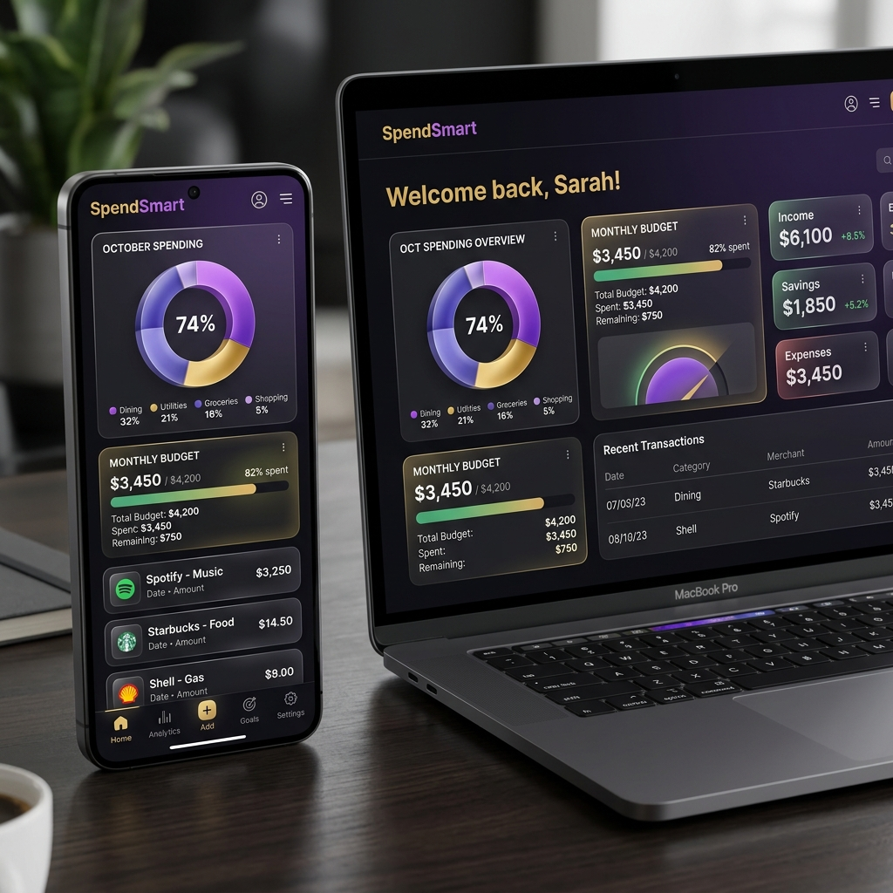

# SpendSmart 💰✨
### *Smart Financial Clarity for the Next Generation*

[](https://reactjs.org/)
[](https://nodejs.org/)
[](https://www.microsoft.com/en-us/sql-server/)
[](https://www.framer.com/motion/)



## 🚀 Overview
**SpendSmart** is a premium, AI-powered financial management application designed specifically for students. It goes beyond simple tracking by providing automated logging tools, behavioral insights, and a gamified experience to help users master their finances.

Built with a focus on **User Experience (UX)** and **Visual Excellence**, SpendSmart features a dense glassmorphism UI, smooth 3D animations, and a fully responsive design.

---

## ✨ Key Features

### 🧠 Intelligence & Automation
- **📸 Bill Scanner (OCR)**: Take a photo of any receipt. Our AI automatically detects the amount, store, and category.
- **🎙️ Voice Input**: Log expenses hands-free by simply speaking.
- **🤖 AI Financial Advice**: Get personalized spending scores and behavioral advice based on your habits.

### 📊 Advanced Analytics
- **Dynamic Dashboard**: Real-time tracking of monthly budgets and all-time spending volume.
- **Visual Trends**: Interactive bar charts (7-day history) and donut charts (category breakdown).
- **Predictive Budgeting**: Automatically calculates how many days your remaining budget will last.

### 🎯 Financial Health Tools
- **Savings Goals**: Set targets for gadgets, travel, or emergency funds and track your progress.
- **Subscription Manager**: Track recurring bills like Netflix or gym memberships and never miss a payment.
- **Soft History Clearing**: Archive old records to keep your view clean without losing your long-term statistical data.

### 🏆 Engagement & Gamification
- **Reward System**: Maintain daily streaks and earn professional badges for smart spending.
- **Celebration Milestones**: High-quality visual feedback when achieving savings targets.
- **Multi-Theme Support**: Seamlessly switch between **Dark** and **Light** modes with customizable accent themes.

---

## 🛠️ Technical Stack
- **Frontend**: React.js, Framer Motion (Animations), Recharts (Data Viz), Lucide-React.
- **Backend**: Node.js, Express.js.
- **Database**: Microsoft SQL Server (MSSQL).
- **Automation**: Tesseract.js (OCR), Nodemailer (Secure OTP).

---

## 📸 Screenshots

| Dashboard | Analytics |
| :---: | :---: |
|  |  |

| Bill Scanner | Savings Goals |
| :---: | :---: |
|  |  |

---

## ⚙️ Installation

### 1. Clone the repository
```bash
git clone https://github.com/shabii804/expense-tracker-web.git
cd expense-tracker-web
```

### 2. Setup Backend
```bash
cd backend
npm install
# Create a .env file with your DB credentials
npm start
```

### 3. Setup Frontend
```bash
# In the root directory
npm install
npm run dev
```

---

## 🤝 Contributing
Contributions are welcome! If you have a suggestion that would make this better, please fork the repo and create a pull request. 

1. Fork the Project
2. Create your Feature Branch (`git checkout -b feature/AmazingFeature`)
3. Commit your Changes (`git commit -m 'Add some AmazingFeature'`)
4. Push to the Branch (`git push origin feature/AmazingFeature`)
5. Open a Pull Request

---

## 📄 License
Distributed under the MIT License. See `LICENSE` for more information.

---
**Built with ❤️ for Students by [SpendSmart Team]**
